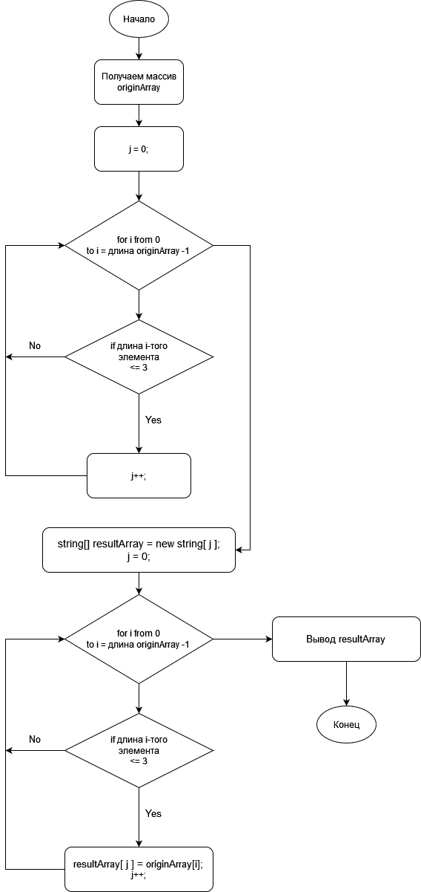

# Описание решения задачи для итоговой работы

**Задача:**
> Написать программу, которая из имеющегося массива строк формирует массив из строк, длина которых не более 3 символов.

**Решение**
1. Исходный массив задается на старте программы: originArray
2. Далее запускается цикл для подсчета искомых элементов в переменной j
3. Следующий цикл - для формирования итогового массива resultArray
4. Следующий цикл - выводит итоговый массив на экран

**Ниже - блок-схема алгоритма:**

